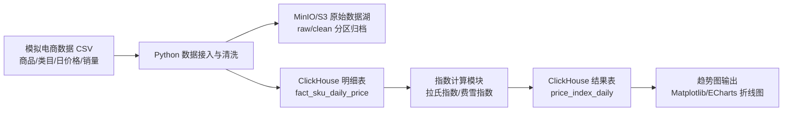

# 高频电商价格指数计算平台系统架构与初步设计报告

## 1. 项目背景

消费者价格指数能够反映宏观经济中的通胀、通缩和行业价格周期，但传统 CPI 依赖人工采集和月度汇总，存在发布滞后、颗粒度较粗、覆盖样本有限等问题。随着电商平台沉淀出大量 SKU 级交易和报价数据，系统可以基于高频电商数据构建按日发布的价格指数，作为传统统计指标的补充。

本项目拟设计一套高频电商价格指数计算平台。平台每日接收千万级商品价格明细，完成数据归档、清洗、聚合计算和趋势输出，最终形成可展示的价格指数折线图。项目当前交付物以设计文档为主，不要求实现完整生产系统，但设计需要按照真实千万级日数据规模进行推演。

## 2. 业务目标与范围

### 2.1 核心目标

1. 支持 T+1 级别的每日指数出表，即今天产出昨天的价格指数。
2. 支持全网整体、类目、SKU 三个层级的指数计算与查询。
3. 支持拉氏指数和费雪指数展示，其中拉氏指数作为必须展示指标，费雪指数作为更合理的高频市场指数。
4. 以销量或销售额折算出的权重参与指数计算，避免只用简单平均价格导致结果失真。
5. 输出日期-指数值折线图，作为业务报告的核心展示形式。

### 2.2 数据范围

本项目数据采用模拟生成方式，可以参考本地已有样例数据扩增生成。当前样例数据位于 `C:\Users\dcf\Desktop\大数据课设\data`，其结构如下：

| 数据文件 | 规模与含义 |
| --- | --- |
| `products.csv` | 约 7 万条商品主数据，包含 `product_id`、`category_id`、`name`、`weight`、`price`、`change_count` |
| `categories.csv` | 约 272 条类目数据，包含 `category_id`、`hierarchy`、`weight`、`parent` |
| `daily_price/` | 约 1095 个日价格文件，每个文件约 2.7 万行，总量约 1.6GB |

课程要求模拟数据不低于 2GB，因此设计中采用“基于现有样例数据扩增”的方式生成 2GB 以上 CSV 数据。扩增方式包括增加日期范围、复制并扰动 SKU、生成销量字段、补充平台和店铺维度等。

### 2.3 边界说明

本次报告只进行系统架构与初步设计，不实现完整生产代码。系统前端不设计复杂报表，只要求能输出价格指数趋势折线图。复杂权限系统、实时流计算、跨平台商品智能匹配、机器学习异常检测等能力不纳入当前版本。

## 3. 架构演进反思

### 3.1 V1：纯业务驱动下的重型架构

如果只根据“每日千万级商品明细、自动化计算、宏观预警、多维下钻”等业务描述进行设计，系统很容易被设计成完整企业级大数据平台：

| 模块 | V1 可能选型 |
| --- | --- |
| 数据采集 | Kafka、Flume、Flink CDC |
| 数据存储 | HDFS、Hive、Iceberg/Hudi |
| 计算引擎 | Spark、Flink、Presto/Trino |
| 调度系统 | Airflow、DolphinScheduler |
| OLAP 查询 | ClickHouse、Druid、StarRocks |
| 可视化 | Superset、Grafana、独立 Web 前端 |
| 运维 | Kubernetes、Prometheus、ELK |

该方案在真实大型企业中具有扩展能力，但对课程项目和小团队而言过于沉重。它会带来较高的部署、调试和维护成本，项目风险会从“指数计算是否合理”转移到“集群环境能否跑起来”。

### 3.2 V2：加入工程约束后的轻量架构

结合课程约束，系统需要满足三个现实条件：

1. 海量数据需要低成本存储。
2. 指数计算需要高性能聚合分析。
3. 小团队缺少专职运维，架构需要轻量、低耦合、易部署。

因此最终采用轻量数据工程架构：

| 能力 | 最终选型 | 理由 |
| --- | --- | --- |
| 原始数据归档 | MinIO / S3 | 对象存储成本低，适合保存全量原始文件，便于重算 |
| 明细与结果分析 | ClickHouse | 列式存储适合按日期、类目聚合，查询性能优于传统行式数据库 |
| 数据处理与调度 | Python | 生态成熟，适合 CSV 清洗、指数计算、调度串联 |
| 数据分析库 | Pandas / Polars | 便于本地样例开发和小批量验证 |
| 图表输出 | Matplotlib / ECharts | 可生成趋势折线图，满足当前报告展示需求 |
| 部署方式 | Docker Compose | 降低 MinIO、ClickHouse 的本地部署复杂度 |

该方案保留了大数据系统的核心思想：数据湖归档、列式 OLAP、批处理调度、结果服务；同时避免引入 Hadoop、Spark、Kafka 等重型组件。

## 4. 总体架构设计

### 4.1 架构总览

系统采用分层架构，整体分为数据源层、数据接入与清洗层、数据湖归档层、OLAP 分析层、指数计算层和结果展示层。



### 4.2 核心模块

| 模块 | 职责 |
| --- | --- |
| 数据生成模块 | 基于样例数据扩增生成 2GB+ 模拟电商数据，补充销量、销售额、平台、店铺等字段 |
| 数据接入模块 | 按日期读取日价格文件，校验字段、类型和文件完整性 |
| 数据清洗模块 | 剔除价格异常、销量异常、重复 SKU 记录，补齐缺失报价 |
| 对象存储模块 | 将原始数据和清洗后数据按日期归档到 MinIO/S3 |
| ClickHouse 写入模块 | 将清洗后的结构化明细批量写入 ClickHouse |
| 指数计算模块 | 根据基期价格、当期价格和销量权重计算拉氏指数、派氏指数和费雪指数 |
| 结果服务模块 | 将指数结果写入结果表，供折线图读取 |
| 可视化模块 | 输出整体指数和类目指数趋势折线图 |

## 5. 数据流水线设计

### 5.1 每日批处理流程

1. 每天凌晨 1 点触发批处理任务。
2. 读取 T-1 日原始商品价格数据。
3. 对输入文件进行格式校验，包括字段数量、日期格式、数值类型、文件行数。
4. 将原始文件上传到对象存储 `raw/dt=YYYY-MM-DD/` 路径。
5. 执行清洗规则，生成标准化明细数据。
6. 将清洗后文件上传到对象存储 `clean/dt=YYYY-MM-DD/` 路径。
7. 批量写入 ClickHouse 明细表。
8. 从 ClickHouse 读取当期与基期数据，计算拉氏指数和费雪指数。
9. 将结果写入 ClickHouse 指数结果表。
10. 读取结果表，生成趋势折线图。

### 5.2 数据分层

| 层级 | 存储位置 | 内容 | 用途 |
| --- | --- | --- | --- |
| Raw | MinIO/S3 | 未改动的原始 CSV 文件 | 保留底稿，便于回溯和重算 |
| Clean | MinIO/S3 | 清洗后标准化 CSV/Parquet 文件 | 作为可重复加载的数据中间层 |
| Detail | ClickHouse | SKU 日价格明细表 | 支撑聚合计算和查询 |
| Result | ClickHouse | 指数结果表 | 支撑趋势图展示 |

## 6. 数据口径设计

### 6.1 商品唯一标识

系统采用 SKU 级商品唯一标识。`product_id` 表示一个具体 SKU，不额外进行跨平台同款商品归并。这样能够降低设计复杂度，避免引入商品标题相似度、规格识别等复杂逻辑。

### 6.2 类目体系

系统沿用样例数据中的 `category_id + parent` 层级结构。类目可以支持一级、二级、三级等多级结构。指数结果既可以计算全网总指数，也可以按任意类目层级计算类目指数。

### 6.3 价格口径

`price` 定义为商品在某一日经过清洗汇总后的当日均价。该价格不再区分挂牌价、优惠价、运费和店铺报价明细。若原始数据中存在同一 SKU 多条报价，则先按 SKU 和日期聚合为当日均价。

### 6.4 权重口径

指数计算必须使用销量或销售额作为权重。考虑到样例数据中已有 `weight` 字段但缺少每日销量字段，本设计做如下定义：

1. `sales_volume` 表示 SKU 当日销量。
2. `sales_amount = price * sales_volume` 表示 SKU 当日销售额。
3. `weight` 表示由销量或销售额折算出的消费权重。
4. 若只有样例 `weight`，可以将其作为基期消费权重使用；在扩增模拟数据时补充 `sales_volume` 字段。

### 6.5 基期口径

采用固定基期设计。系统指定某一日期为基准日，基准日指数为 100。默认可将模拟数据的第一天作为基期，例如 `2025-05-17`。后续所有日期均与基期价格和基期权重比较。

固定基期有两个优点：

1. 折线图解释简单，用户可以直观看到相对于基期的涨跌。
2. 拉氏指数需要固定基期销量权重，固定基期更符合公式定义。

后续如需长期运行，可增加年度换基机制，例如每年 1 月 1 日重新设定基期。

## 7. 数据清洗规则

### 7.1 基础清洗

| 问题 | 处理规则 |
| --- | --- |
| `product_id` 为空 | 丢弃记录 |
| `category_id` 为空 | 丢弃记录或归入未知类目 |
| `price <= 0` | 视为异常价格，丢弃 |
| `sales_volume < 0` | 视为异常销量，丢弃 |
| 日期格式错误 | 丢弃并记录错误日志 |
| 同一日同一 SKU 多条记录 | 按价格均值或销量加权均价聚合 |

### 7.2 异常价格处理

价格异常会直接影响指数，因此需要设置防御规则：

1. 单 SKU 当日价格相对前一有效日涨跌超过 300%，标记为异常。
2. 类目内价格偏离中位数超过 5 倍中位绝对偏差，标记为异常。
3. 异常记录不直接进入指数计算，而是进入异常明细表，等待人工或后续规则复核。

### 7.3 缺失报价处理

商品在某日缺失报价时，按以下规则处理：

1. 连续缺失 1 到 3 天：使用最近有效价格进行短期填补。
2. 连续缺失超过 3 天：该 SKU 暂停参与当期指数计算。
3. 长期缺失或下架商品：在下一次基期切换时从固定篮子中移除。

### 7.4 新品与下架

拉氏指数依赖固定基期商品篮子，因此新品不能立即进入主指数。新品先进入观察池，当系统进行年度换基或重新抽样时再纳入。下架商品在短期内可用最近有效价填补，长期下架则在换基时移除。

## 8. 指数计算设计

### 8.1 拉氏指数

拉氏指数使用基期销量作为固定权重，衡量当期价格相对基期价格的变化：

```text
L_t = (sum(p_t * q_0) / sum(p_0 * q_0)) * 100
```

其中：

| 符号 | 含义 |
| --- | --- |
| `p_t` | 当期价格 |
| `p_0` | 基期价格 |
| `q_0` | 基期销量 |
| `L_t` | 当期拉氏指数 |

拉氏指数实现简单、解释清晰，适合作为课程项目中的主展示指标。但它使用固定基期权重，长期运行时可能忽略消费者替代行为。

### 8.2 派氏指数

派氏指数使用当期销量作为权重：

```text
P_t = (sum(p_t * q_t) / sum(p_0 * q_t)) * 100
```

其中 `q_t` 表示当期销量。派氏指数能够反映当期消费结构，但对当期销量质量更敏感。

### 8.3 费雪指数

费雪指数是拉氏指数和派氏指数的几何平均：

```text
F_t = sqrt(L_t * P_t)
```

费雪指数兼顾基期权重和当期权重，更适合电商高频市场。系统最终结果表中同时保存拉氏指数和费雪指数，折线图默认展示拉氏指数，可选择叠加费雪指数。

### 8.4 分层计算

指数计算支持三个层级：

| 层级 | 计算方式 |
| --- | --- |
| SKU | 计算单个 SKU 相对基期的价格比值 |
| 类目 | 对类目下所有 SKU 按销量权重聚合 |
| 全网 | 对所有类目或所有 SKU 按权重聚合 |

类目指数可以自底向上聚合：先计算三级类目，再根据类目权重汇总到二级、一级和全网。

## 9. ClickHouse Schema 设计

### 9.1 商品维表：`dim_product`

```sql
CREATE TABLE dim_product
(
    product_id String,
    category_id String,
    product_name String,
    base_price Decimal(18, 4),
    base_weight Float64,
    change_count UInt32,
    created_at DateTime DEFAULT now()
)
ENGINE = MergeTree
ORDER BY (category_id, product_id);
```

设计理由：

1. `product_id` 使用 String，兼容样例数据中的长数字 ID。
2. `category_id` 放入排序键，便于按类目筛选商品。
3. `base_price` 和 `base_weight` 用于固定基期指数计算。

### 9.2 类目维表：`dim_category`

```sql
CREATE TABLE dim_category
(
    category_id String,
    category_name String,
    hierarchy UInt8,
    parent_id String,
    category_weight Float64
)
ENGINE = MergeTree
ORDER BY (hierarchy, parent_id, category_id);
```

设计理由：

1. 支持多级类目结构。
2. `parent_id` 用于类目树递归和自底向上聚合。
3. `category_weight` 可用于不同类目之间的总指数加权。

### 9.3 SKU 日价格明细表：`fact_sku_daily_price`

```sql
CREATE TABLE fact_sku_daily_price
(
    stat_date Date,
    product_id String,
    category_id String,
    platform LowCardinality(String),
    shop_id String,
    price Decimal(18, 4),
    sales_volume UInt64,
    sales_amount Decimal(20, 4),
    weight Float64,
    is_filled UInt8 DEFAULT 0,
    is_abnormal UInt8 DEFAULT 0,
    created_at DateTime DEFAULT now()
)
ENGINE = MergeTree
PARTITION BY toYYYYMM(stat_date)
ORDER BY (stat_date, category_id, product_id)
SETTINGS index_granularity = 8192;
```

设计理由：

1. `PARTITION BY toYYYYMM(stat_date)` 适合按日期范围查询，避免分区过多。
2. `ORDER BY (stat_date, category_id, product_id)` 贴合核心查询模式：按日期、类目聚合指数。
3. `LowCardinality(String)` 适合平台这类低基数字符串字段，可降低存储成本。
4. `is_filled` 标识是否由缺失报价填补生成，便于后续质量分析。
5. `is_abnormal` 标识异常记录，避免污染正式指数。

### 9.4 指数结果表：`price_index_daily`

```sql
CREATE TABLE price_index_daily
(
    stat_date Date,
    index_level LowCardinality(String),
    category_id String,
    product_id String,
    index_type LowCardinality(String),
    index_value Float64,
    base_date Date,
    sample_count UInt64,
    total_weight Float64,
    created_at DateTime DEFAULT now()
)
ENGINE = MergeTree
PARTITION BY toYYYYMM(stat_date)
ORDER BY (stat_date, index_level, category_id, product_id, index_type);
```

设计理由：

1. 同一张表保存全网、类目、SKU 多层级指数。
2. `index_type` 区分 `laspeyres`、`paasche`、`fisher`。
3. `sample_count` 和 `total_weight` 用于判断当天样本覆盖是否异常。
4. 折线图主要按 `stat_date + index_type + category_id` 查询，排序键能支撑该访问模式。

## 10. 物理目录设计

若后续进入代码实现阶段，建议使用以下目录结构：

```text
practice-course/
├── README.md
├── business_requirements.md
├── system_architecture_initial_design.md
├── config/
│   └── config.yaml
├── scripts/
│   ├── generate_mock_data.py
│   └── render_index_chart.py
├── sql/
│   ├── 001_create_dim_product.sql
│   ├── 002_create_dim_category.sql
│   ├── 003_create_fact_sku_daily_price.sql
│   └── 004_create_price_index_daily.sql
├── src/
│   ├── ingestion/
│   │   ├── reader.py
│   │   └── cleaner.py
│   ├── storage/
│   │   ├── object_store.py
│   │   └── clickhouse_client.py
│   ├── compute/
│   │   └── price_index.py
│   └── main.py
├── tests/
│   ├── test_cleaner.py
│   └── test_price_index.py
└── docker-compose.yml
```

该目录结构遵循高内聚、低耦合原则。`compute` 模块只保留数学计算逻辑，不直接连接数据库；`storage` 模块只封装存储交互；`main.py` 串联完整流水线。

## 11. 趋势图设计

本项目最终展示形式为价格指数折线图。图表至少包含：

| 图表元素 | 说明 |
| --- | --- |
| 横轴 | 日期 |
| 纵轴 | 指数值，基期为 100 |
| 默认曲线 | 全网拉氏指数 |
| 可选曲线 | 全网费雪指数、指定类目拉氏指数 |
| 标题 | 高频电商价格指数趋势图 |

数据查询示例：

```sql
SELECT
    stat_date,
    index_type,
    index_value
FROM price_index_daily
WHERE index_level = 'overall'
  AND category_id = ''
  AND index_type IN ('laspeyres', 'fisher')
ORDER BY stat_date;
```

如果只生成静态报告，可以使用 Python Matplotlib 输出 PNG 图片；如果需要交互式展示，可以使用 ECharts 读取结果表或导出的 JSON 数据。

## 12. 非功能设计

### 12.1 性能目标

| 指标 | 目标 |
| --- | --- |
| 日新增数据 | 千万级商品明细 |
| 批处理频率 | 每日一次 |
| 出表时效 | T+1 |
| 单日指数计算 | 分钟级完成 |
| 趋势图查询 | 秒级返回 |

### 12.2 可扩展性

1. 原始数据存储在对象存储中，可以低成本横向扩展。
2. ClickHouse 支持单机到集群扩展，课程阶段可先使用单机部署。
3. 数据分区按月设计，后续可以按数据量调整为按周或按天。

### 12.3 可重算性

所有原始数据先进入对象存储，不被覆盖或删除。若清洗规则、指数公式或基期口径发生变化，可以从 Raw 层重新计算历史结果。

### 12.4 数据质量监控

需要记录以下质量指标：

1. 每日输入文件数量和总行数。
2. 清洗后有效记录数。
3. 异常价格记录数。
4. 缺失填补记录数。
5. 当日指数相对昨日涨跌幅。

如果全网指数单日涨跌超过 50%，系统应阻断发布并输出告警，因为这大概率表示源数据污染或计算逻辑错误。

## 13. 模拟数据生成方案

为了满足 2GB+ 数据规模，可基于已有样例做扩增：

1. 读取 `products.csv` 和 `categories.csv`，保留原有 SKU 与类目结构。
2. 对商品表进行复制扩展，生成新的 `product_id`，并对价格增加小幅随机扰动。
3. 对日价格数据按日期循环扩展，生成更长时间跨度或更多 SKU 的日价格文件。
4. 增加 `sales_volume` 字段，按商品类目、价格区间和随机波动生成销量。
5. 增加促销日波动，例如 6.18、11.11、12.12 附近提高销量并扰动价格。
6. 输出 CSV 文件，确保总文件大小超过 2GB。

模拟数据不追求完全真实，但需要满足指数计算的基本规律：价格不能长期为 0，销量不能为负，类目权重和商品权重需要相对稳定。

## 14. 风险与后续优化

| 风险 | 影响 | 应对 |
| --- | --- | --- |
| 模拟数据缺少真实销量 | 权重解释不足 | 扩增时补充 `sales_volume`，并说明 `weight` 来源 |
| 固定基期长期失真 | 指数代表性下降 | 设计年度换基机制 |
| 新品和下架处理复杂 | 商品篮子不稳定 | 新品观察池、下架商品短期填补、换基时调整 |
| 单机 ClickHouse 容量有限 | 数据增长后性能下降 | 课程阶段单机，生产阶段可扩展为集群 |
| 价格异常污染指数 | 折线图出现突刺 | 增加异常检测和发布熔断 |

## 15. 初步结论

本项目最终采用“对象存储 + ClickHouse + Python”的轻量数据工程架构。该方案能够满足高频电商价格指数系统的核心需求：低成本保存海量原始数据、快速完成按日和按类目的聚合计算、支持拉氏指数与费雪指数输出，并以折线图形式展示趋势。

相较于 Hadoop、Spark、Kafka 等重型大数据架构，本方案更符合课程项目的小团队、低运维、可快速落地的约束。它既保留了数据湖、OLAP、批处理、结果服务等现代数据工程的关键思想，也避免了过度工程化带来的复杂性。
